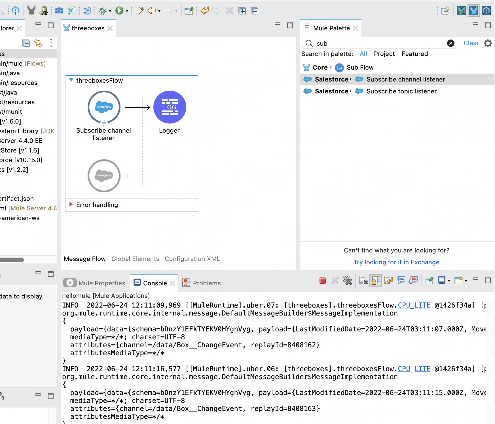

# Simple logger for "/data/Box__ChangeEvent" (CDC)

I have enabled CDC on the custom object "Box__c". This markdown page is just to show how easy to subscribe a CDC channel through Salesforce Connector provided by Mulesoft.

## Mule flow on AnypointStudio



#### Log example

```
INFO  2022-06-24 12:11:09,969 [[MuleRuntime].uber.07: [threeboxes].threeboxesFlow.CPU_LITE @1426f34a] [processor: threeboxesFlow/processors/0; event: 4bbbc590-f36b-11ec-baf5-50ed3c405e70] org.mule.runtime.core.internal.processor.LoggerMessageProcessor: 
org.mule.runtime.core.internal.message.DefaultMessageBuilder$MessageImplementation
{
  payload={data={schema=bDnzY1EFkTYEKV0HYghVyg, payload={LastModifiedDate=2022-06-24T03:11:07.000Z, Move__c=true, ChangeEventHeader={commitNumber=286552425939, commitUser=0055i000003uX2eAAE, sequenceNumber=1, entityName=Box__c, changeType=UPDATE, changedFields=[LastModifiedDate, Move__c], changeOrigin=, transactionKey=0001f70e-dc68-93ba-b742-74e39e8c7193, commitTimestamp=1656040267000, recordIds=[a005i000004XJGDAA4]}}, event={replayId=8408162}}, channel=/data/Box__ChangeEvent}
  mediaType=*/*; charset=UTF-8
  attributes={channel=/data/Box__ChangeEvent, replayId=8408162}
  attributesMediaType=*/*
}
INFO  2022-06-24 12:11:16,577 [[MuleRuntime].uber.06: [threeboxes].threeboxesFlow.CPU_LITE @1426f34a] [processor: threeboxesFlow/processors/0; event: 4fb07f60-f36b-11ec-baf5-50ed3c405e70] org.mule.runtime.core.internal.processor.LoggerMessageProcessor: 
org.mule.runtime.core.internal.message.DefaultMessageBuilder$MessageImplementation
{
  payload={data={schema=bDnzY1EFkTYEKV0HYghVyg, payload={LastModifiedDate=2022-06-24T03:11:15.000Z, Move__c=false, ChangeEventHeader={commitNumber=286552528195, commitUser=0055i000003uX2eAAE, sequenceNumber=1, entityName=Box__c, changeType=UPDATE, changedFields=[LastModifiedDate, Move__c], changeOrigin=, transactionKey=0001f710-a844-a2a5-feee-38163b9ea5f1, commitTimestamp=1656040275000, recordIds=[a005i000004XJGIAA4]}}, event={replayId=8408163}}, channel=/data/Box__ChangeEvent}
  mediaType=*/*; charset=UTF-8
  attributes={channel=/data/Box__ChangeEvent, replayId=8408163}
  attributesMediaType=*/*
}
INFO  2022-06-24 12:11:18,042 [[MuleRuntime].uber.06: [threeboxes].threeboxesFlow.CPU_LITE @1426f34a] [processor: threeboxesFlow/processors/0; event: 50919090-f36b-11ec-baf5-50ed3c405e70] org.mule.runtime.core.internal.processor.LoggerMessageProcessor: 
org.mule.runtime.core.internal.message.DefaultMessageBuilder$MessageImplementation
{
  payload={data={schema=bDnzY1EFkTYEKV0HYghVyg, payload={LastModifiedDate=2022-06-24T03:11:17.000Z, Move__c=true, ChangeEventHeader={commitNumber=286552559684, commitUser=0055i000003uX2eAAE, sequenceNumber=1, entityName=Box__c, changeType=UPDATE, changedFields=[LastModifiedDate, Move__c], changeOrigin=, transactionKey=0001f711-2e69-014c-144e-af955d77f49c, commitTimestamp=1656040277000, recordIds=[a005i000004XJGNAA4]}}, event={replayId=8408164}}, channel=/data/Box__ChangeEvent}
  mediaType=*/*; charset=UTF-8
  attributes={channel=/data/Box__ChangeEvent, replayId=8408164}
  attributesMediaType=*/*
}
```
