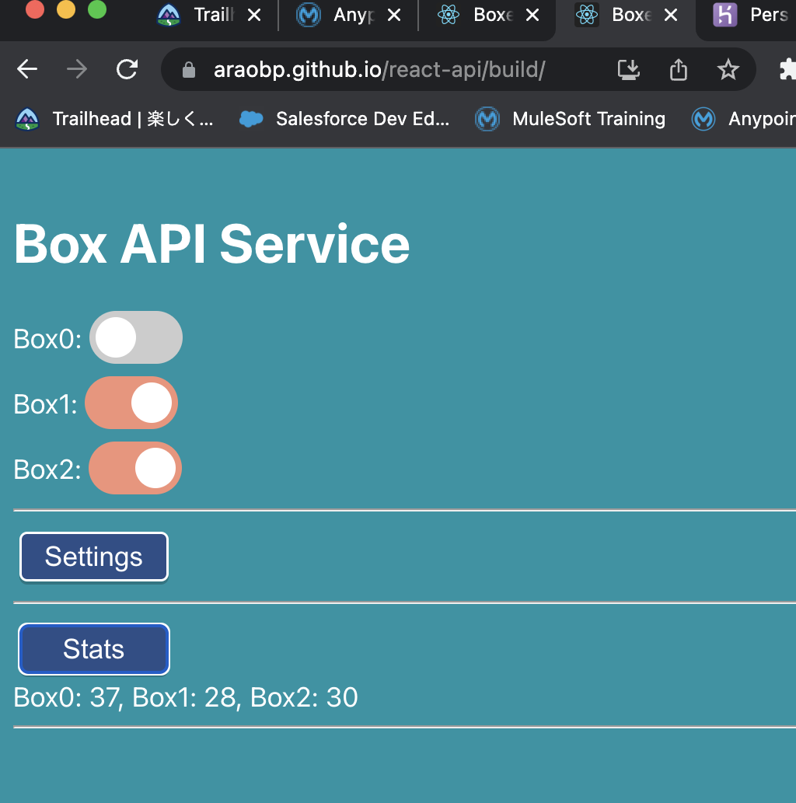

# Salesforce & Heroku Integration demo

My original Salesforce & Heroku Integration demo.

## Architecture

## UIs

#### "Box" custom object in list view on Salesforce Cloud

#### "Box" Lightning Web Components and APEX on Salesforce Cloud

#### "Boxes" on React

#### "Boxes" on Unity

## Box custom object definition on Salesforce Cloud

## Projects

- [spring-api](https://github.com/araobp/spring-api) -- SpringBoot-based backend as API server with PostgreSQL
- [react-api](https://github.com/araobp/react-api) -- React-based fronend for manipulating database remotely
- [unity-api](https://github.com/araobp/unity-api) -- Unity-based frontend for 3D visualization
- ["Box" Lightning Web Component and its accompanying APEX code](box/force-app/main/default)

## Reference and tools

- [Salesforce & Heroku Integration](https://trailhead.salesforce.com/en/content/learn/modules/salesforce_heroku_integration)
- [APEX Integration Services](https://trailhead.salesforce.com/content/learn/modules/apex_integration_services)
- [JSON2APEX](https://json2apex.herokuapp.com/)
- [Lightning Web Components and Salesforce Data](https://trailhead.salesforce.com/en/content/learn/modules/lightning-web-components-and-salesforce-data)
- [Forcecraft - Visualize your Salesforce Org in Minecraft!](https://youtu.be/eb3GgM1o_8I).

