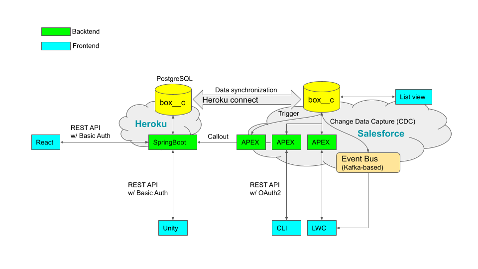

# Salesforce & Heroku Integration demo

My original Salesforce & Heroku Integration demo. It is very simple.

## Architecture



## UIs

#### "Box" custom object in list view on Salesforce Cloud


#### "Box" Lightning Web Components and APEX on Salesforce Cloud


#### "Boxes" on React


#### "Boxes" on Unity


## Box custom object definition on Salesforce Cloud


## Projects

- [spring-api](https://github.com/araobp/spring-api) -- SpringBoot-based backend as API server with PostgreSQL
- [react-api](https://github.com/araobp/react-api) -- React-based fronend for manipulating database remotely
- [unity-api](https://github.com/araobp/unity-api) -- Unity-based frontend for 3D visualization
- ["Box" unmanaged package on my Salesforce development edition](./BOX_UNMANAGED_PACKAGE.md)

## References

#### Trailhead

- [Salesforce & Heroku Integration](https://trailhead.salesforce.com/en/content/learn/modules/salesforce_heroku_integration)
- [Apex Integration Services](https://trailhead.salesforce.com/content/learn/modules/apex_integration_services)
- [Set up authorization for a connected app](https://developer.salesforce.com/docs/atlas.en-us.224.0.chatterapi.meta/chatterapi/CR_quickstart_oauth.htm?_ga=2.5544307.1994630704.1652930169-91847829.1642576173)
- [Asynchronous Apex](https://trailhead.salesforce.com/content/learn/modules/asynchronous_apex)
- [Lightning Web Components and Salesforce Data](https://trailhead.salesforce.com/en/content/learn/modules/lightning-web-components-and-salesforce-data)
- [Unlocked Packages for Customers](https://trailhead.salesforce.com/en/content/learn/modules/unlocked-packages-for-customers)
- [Forcecraft - Visualize your Salesforce Org in Minecraft!](https://youtu.be/eb3GgM1o_8I).
- [Trailhead Sample Gallery](https://trailhead.salesforce.com/en/sample-gallery)

#### SFDX Cheat Sheet

- [Salesforce SFDX Cheat Sheet](https://gist.github.com/jsmithdev/65d8b5892de2ca6a7d85ee8a7b3f0355)

#### Tools

- [JSforce](https://jsforce.github.io/)
- [JSON2APEX](https://json2apex.herokuapp.com/)

#### Salesforce tips

=> [Wiki](https://github.com/araobp/sfdc-demo/wiki)

- [{"error":"invalid_grant","error_description":"authentication failure"}](https://salesforce.stackexchange.com/questions/339872/errorinvalid-grant-error-descriptionauthentication-failure)
- [View instance information for your Salesforce Organization](https://help.salesforce.com/s/articleView?id=000322728&type=1)

#### Salesforce-SAP integration

- [Vigience](https://www.vigience.com/)
- [Mulesoft](https://www.mulesoft.com/resources/esb/sap-salesforce-integration#:~:text=When%20SAP%20and%20Salesforce%20are,entry%2C%20saving%20time%20and%20money)

#### tips: cURL example to fetch a Case record from Salesforce Cloud

In case of this Trailhead module "[APEX Integration Services, APEX Web Services](https://trailhead.salesforce.com/content/learn/modules/apex_integration_services/apex_integration_webservices)",

```
[1] Obtain an access token:
curl -v https://login.salesforce.com/services/oauth2/token --header 'Content-Type: application/x-www-form-urlencoded' --data-urlencode "grant_type=password" --data-urlencode "client_id=<your_consumer_key>" --data-urlencode "client_secret=<your_consumer_secret>" --data-urlencode "username=<your_username>" --data-urlencode "password=<your_password_and_security_token>" -H "X-PrettyPrint:1"

[2] Include the acecss token in a REST request to fetch a Case record:
curl https://<your_instance>.my.salesforce.com/services/apexrest/Cases/<Record_ID> -H "Authorization: Bearer <your_session_id>" -H "X-PrettyPrint:1"
```

## Afternote

After having implemented this simple integration app, I think Apex, SOQL and DML are really cool!

Just one line to fetch fields from a table,
```
Box__c box = [SELECT Id__c, Name, Move__c FROM Box__c WHERE Id__c = :boxId];
```

Just one line to update a record,
```
thisBox.Move__c = move;
update thisBox;
```
